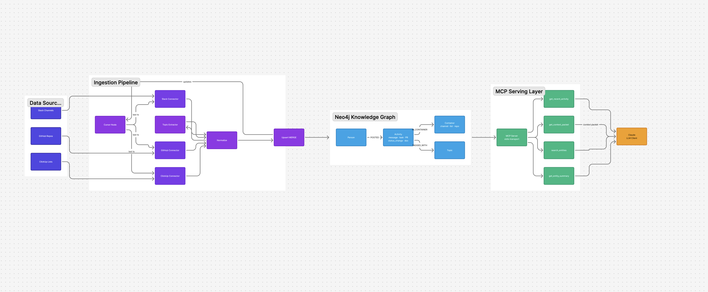

# Brainifai

A Personal Knowledge Graph (PKG) that grows automatically from your daily tools and lets you query it through Claude.

Data flows in from Slack, GitHub, ClickUp, and Apple Calendar, lands in a local Neo4j graph, and is exposed to Claude via an MCP server. Ask natural-language questions and get grounded context from your actual activity — people, topics, conversations, tasks, pull requests, calendar events.

---

## Architecture



---

## How it works

```
Slack / GitHub / ClickUp / Apple Calendar
   ↓  fetch messages, PRs, tasks, events, status changes (paginated, incremental)
Ingestion pipeline
   ↓  normalize → Person, Activity, Topic, Container nodes
   ↓  MERGE into Neo4j (idempotent, re-run safe)
   ↓  cursor per source/channel/list (only fetches new data next run)
Neo4j (Docker, local)
   ↑  Cypher: fulltext search, time windows, graph traversal
MCP Server (stdio)
   ↑  4 curated tools — no raw Cypher exposed to Claude
Claude (Desktop or Claude Code)
```

### The graph model

Everything is **Entities** + **Activities**.

| Node | Unique key | What it represents |
|------|-----------|-------------------|
| `Person` | `person_key` (e.g. `slack:U12345`, `github:octocat`) | A human across sources |
| `Activity` | `(source, source_id)` | A single message / PR / task / event / status change |
| `Topic` | `name` (lowercase) | A keyword, hashtag, label, or task status |
| `Container` | `(source, container_id)` | A Slack channel, GitHub repo, ClickUp list, or calendar |
| `SourceAccount` | `(source, account_id)` | A tool-specific identity, linked to a Person |
| `Cursor` | `(source, container_id)` | Tracks ingestion progress per source |

**Activity kinds**: `message`, `task`, `task_comment`, `status_change`, `pull_request`, `pr_comment`, `pr_review`, `doc`, `calendar_event`

### Incremental ingestion

On first run, ingestion backfills the last `BACKFILL_DAYS` (default: 7) of data per source. On every subsequent run it only fetches data newer than the last cursor. Cursors live in Neo4j — wiping the database resets them and triggers a clean backfill automatically.

All sources are optional — each is skipped if its credentials are not set in `.env`.

### MCP tools

| Tool | What it does |
|------|-------------|
| `get_context_packet` | **Primary tool.** Given a query, finds matching entities, gathers structural facts, pulls time-windowed evidence. Returns a bounded JSON payload. |
| `search_entities` | Fulltext search across Person, Topic, Container nodes. |
| `get_entity_summary` | Activity count, most recent activity, top connections for one entity. |
| `get_recent_activity` | Time-windowed activity feed, filterable by person, topic, or channel. |

Safety limits are always enforced: max 20 evidence items, max 8,000 chars total, 10s query timeout.

### Topic extraction

Topics are extracted from every activity two ways:
1. **Hashtags** — `#deploy`, `#incident`, etc.
2. **GitHub labels** — label names are automatically added as topics.
3. **Allowlist matching** — configurable list of keywords (case-insensitive), set via `TOPIC_ALLOWLIST`.
4. **Task status** — ClickUp task statuses (e.g. `in-progress`, `done`) are stored as topics automatically.

---

## Setup

### Prerequisites

- [Docker Desktop](https://www.docker.com/products/docker-desktop/)
- [Node.js](https://nodejs.org/) 20+

### 1. Clone and install

```bash
git clone <repo-url>
cd Brainifai
npm install
```

### 2. Configure environment

```bash
cp .env.example .env
```

| Variable | Required | Description |
|----------|----------|-------------|
| `NEO4J_URI` | Yes | Bolt connection URI (default: `bolt://localhost:7687`) |
| `NEO4J_USER` | Yes | Neo4j username (default: `neo4j`) |
| `NEO4J_PASSWORD` | Yes | Neo4j password |
| `SLACK_BOT_TOKEN` | No | Slack bot token (`xoxb-...`) |
| `SLACK_CHANNEL_IDS` | No | Comma-separated Slack channel IDs |
| `GITHUB_TOKEN` | No | GitHub personal access token (`ghp_...`) |
| `GITHUB_REPOS` | No | Comma-separated repos (`owner/repo,owner/repo2`) |
| `CLICKUP_TOKEN` | No | ClickUp API token (`pk_...`) |
| `CLICKUP_LIST_IDS` | No | Comma-separated ClickUp list IDs |
| `APPLE_CALDAV_USERNAME` | No | Apple ID email address |
| `APPLE_CALDAV_PASSWORD` | No | App-specific password (see setup below) |
| `APPLE_CALDAV_CALENDARS` | No | Comma-separated calendar names to include (empty = all) |
| `BACKFILL_DAYS` | No | Days to backfill on first run (default: `7`) |
| `TOPIC_ALLOWLIST` | No | Comma-separated keywords for topic extraction |

### 3. Start Neo4j

```bash
docker compose up -d
npm run test-connection    # should print "Connected to Neo4j"
npm run schema             # create constraints and fulltext index
```

### 4. Set up data sources (all optional)

#### Slack

1. Go to [api.slack.com/apps](https://api.slack.com/apps) → **Create New App** → From scratch
2. **OAuth & Permissions → Bot Token Scopes** → add `channels:history`, `channels:read`
3. **Install to Workspace** → copy the `xoxb-...` token into `.env`
4. Invite the bot to each channel: `/invite @your-bot-name`
5. Get channel IDs: click the channel name in Slack → copy the ID at the bottom

#### GitHub

1. GitHub → **Settings → Developer settings → Personal access tokens → Tokens (classic)**
2. Generate a token with `repo` (or `public_repo`) and `read:user` scopes
3. Set `GITHUB_TOKEN` and `GITHUB_REPOS` in `.env`

#### ClickUp

1. ClickUp → **Settings → Apps → API Token** → copy the `pk_...` token
2. Get list IDs from the URL when viewing a list: `.../list/{LIST_ID}`
3. Set `CLICKUP_TOKEN` and `CLICKUP_LIST_IDS` in `.env`

Ingests: tasks (name + description), comments, docs, and **full status change history**.

#### Apple Calendar

1. Go to [appleid.apple.com](https://appleid.apple.com) → **Sign-In and Security → App-Specific Passwords** → generate one
2. Set `APPLE_CALDAV_USERNAME` (your Apple ID email) and `APPLE_CALDAV_PASSWORD` (the app-specific password) in `.env`
3. Optionally set `APPLE_CALDAV_CALENDARS` to limit which calendars are ingested

Connects via CalDAV to iCloud. Fetches events from `BACKFILL_DAYS` ago through 30 days into the future.

### 5. Run ingestion

```bash
npm run ingest
```

Output looks like:
```
Slack #general: ingested 142 messages
GitHub anagnole/myrepo: ingested 12 PRs, 34 comments
ClickUp My List: ingested 28 tasks, 56 comments
Apple Calendar: ingested 43 events
Ingestion complete
```

Re-run anytime — only new data is fetched.

---

## Using with Claude

### Claude Code (recommended)

Add to `~/.claude.json` so it's available in every project:

```bash
claude mcp add brainifai --scope user -- npx tsx \
  --env-file=/absolute/path/to/Brainifai/.env \
  /absolute/path/to/Brainifai/src/mcp/index.ts
```

### Claude Desktop

Configure in `~/Library/Application Support/Claude/claude_desktop_config.json`:

```json
{
  "mcpServers": {
    "brainifai": {
      "command": "npx",
      "args": ["tsx", "--env-file=.env", "src/mcp/index.ts"],
      "cwd": "/absolute/path/to/Brainifai"
    }
  }
}
```

### Example queries

> *"What has the team been discussing about deployments this week?"*
> *"Who are the most active people in #engineering?"*
> *"What PRs have been merged in myrepo recently?"*
> *"Which ClickUp tasks moved to done this week?"*
> *"What meetings do I have coming up that mention the API migration?"*
> *"Get a context packet for the incident we had last Friday"*

---

## Commands reference

```bash
docker compose up -d        # Start Neo4j
docker compose down         # Stop Neo4j (data persists in volume)
docker compose down -v      # Stop + wipe all data (triggers fresh backfill on next ingest)

npm run test-connection     # Verify Neo4j connectivity
npm run schema              # Create/update constraints and indexes
npm run ingest              # Fetch new data from all configured sources
npm run mcp                 # Start MCP server

npx tsc --noEmit            # Type check
```

---

## Project structure

```
src/
  shared/                 Neo4j driver, canonical types, schema, constants
  ingestion/
    slack/                Slack connector (client, config, normalize, types)
    github/               GitHub connector (PRs, comments, reviews)
    clickup/              ClickUp connector (tasks, comments, docs, status changes)
    apple-calendar/       Apple Calendar connector (CalDAV/iCloud)
    topic-extractor.ts    Hashtag + allowlist topic extraction
    upsert.ts             Source-agnostic MERGE-based upsert
    cursor.ts             Incremental ingestion state
    index.ts              Ingestion entry point
  mcp/                    MCP server, 4 tools, Cypher queries, safety limits
  mcp-fal/                fal.ai image generation MCP server
  scripts/                One-off utilities (test-connection, seed-schema)
docker-compose.yml
.env.example
```

---

## Adding more data sources

The pipeline is designed to be extended. To add a new source:

1. Create `src/ingestion/<source>/` with `types.ts`, `config.ts`, `client.ts`, `normalize.ts` — mirror the `clickup/` structure
2. Map to `NormalizedMessage` from `src/shared/types.ts`
3. Use the existing `upsertBatch()` and `setCursor()` functions — fully source-agnostic
4. Add a guarded block in `src/ingestion/index.ts` (skip if token not set)

The graph model handles multi-source identity naturally: one `Person` node can link to multiple `SourceAccount` nodes across different tools.
